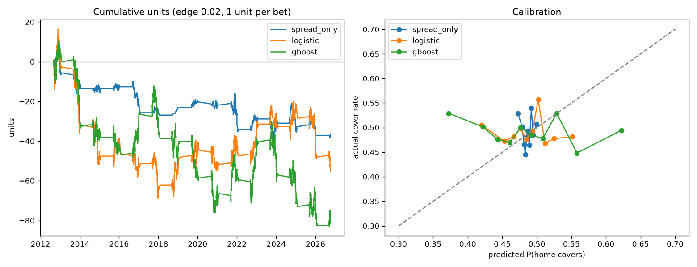

# NFL Against-the-Spread Model

Predicts whether the home team covers the closing spread, using nflverse data
(2006–present), and backtests it the way you'd have used it in real time.

## Results

Walk-forward backtest over 2012–2026 (3,795 games, each predicted by a model trained only on earlier seasons):

| Model | Win rate vs. spread | Log loss | Brier score |
|---|---|---|---|
| `spread_only` (control) | 51.3% | 0.693 | 0.250 |
| Logistic regression | 50.0% | 0.696 | 0.252 |
| Gradient boosting | 49.8% | 0.706 | 0.256 |

No model beat the 52.38% break-even, and neither feature model improved log loss over the control
(0.693 is what you get from predicting 50% for every game). Team efficiency, rest, weather and QB
changes appear to be already priced into the closing spread. Gradient boosting's wider, worse-calibrated
predictions suggest it fits noise in the training seasons.



## Setup

```bash
python -m venv .venv
.venv\Scripts\activate
pip install -r requirements.txt
python backtest.py
```

The first run downloads about 20 seasons of play-by-play (a few minutes); after that it's cached in `data/`.

## Files

- `data.py`: downloads schedules (scores, closing spreads, odds, rest, QBs) and summarizes play-by-play into per-team, per-game EPA and success rate.
- `features.py`: builds pre-kickoff features: exponentially weighted EPA ratings, recent ATS form, QB changes, rest, weather, and dome/neutral/playoff flags. Every rolling stat is shifted by one game so there's no leakage.
- `backtest.py`: walk-forward backtest (train on seasons before S, test on S), with win rate, units, ROI and a binomial p-value against the 52.38% break-even. Also produces calibration and cumulative-profit plots and probabilities for upcoming games.

## Reading the results

- `spread_only` is the control. It should land near 50%. If it doesn't, something is leaking.
- A model only has an edge if it beats **52.38%** over many bets with a small p-value. Expect most attempts to land between 49% and 52%. The closing line is a very efficient market.
- Every feature or threshold you try is another chance to fit noise. Hold out the most recent season or two and look at them only at the end.
- Closing lines are the hardest version of this problem. Betting earlier in the week, against opening lines, is where models tend to find edges, but you'd need opening-line data.
